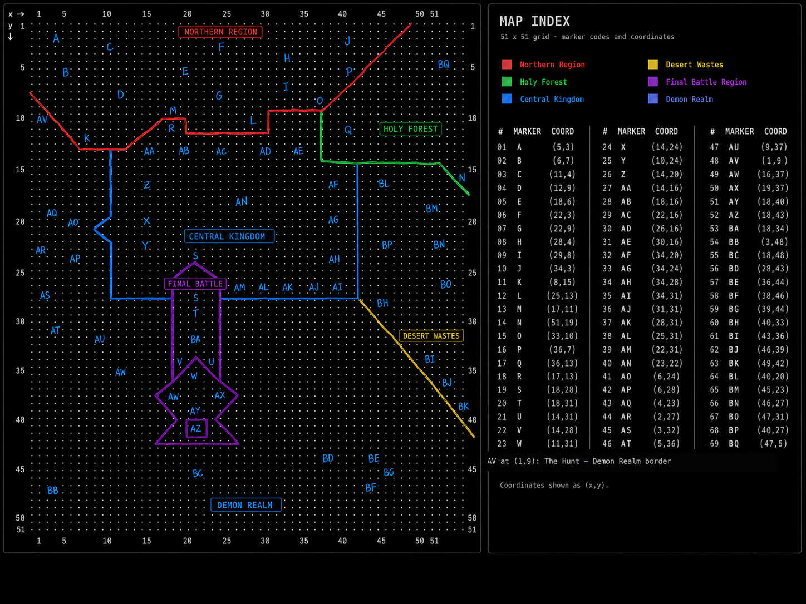

# After the Final Battle — Complete World Experiment

> A fully playable narrative prototype about grief, choice, and rebuilding after the victory that ended the world.

**[Open After the Final Battle - Complete World Experiment](https://htmlpreview.github.io/?https://github.com/mewzicians/After-the-final-battle-test-build/blob/main/After%20the%20Final%20Battle%20-%20Complete%20World%20Experiment.html)**

The Demon King is dead. The Hero won. Thousands of years later, his younger brother leaves a failing shelter and discovers that the final battle never truly ended—it became the shape of everything that survived.

This public test build expands the original Northern Region prototype into one connected journey across the continent. It is an **experimental branch**, not a replacement for the project's approved v18 build or a declaration that every new story answer is permanent canon.



## Play

Download or clone the repository, then open:

**`After the Final Battle - Complete World Experiment.html`**

It runs locally in a modern desktop browser. No installation or internet connection is required.

### Combat controls

| Incoming attack | Response | Result when timed correctly |
| --- | --- | --- |
| Light | Dodge | Avoid all damage |
| Medium | Attack | Clash, cancel damage, gain +1 damage for the fight |
| Heavy | Parry | Deflect all damage |

You may attack outside a clash window. Dodge and Attack share a cooldown length; Dodge is 75% of Parry's cooldown. Each cooldown scales independently with its associated story-trained stat. The first fight includes a spotlight tutorial, and the battle log remains scrollable in real time.

## What this experiment contains

- 69 named locations across all eight world regions, each with ordinary-life detail, danger, evidence, an item, and a story-linked stat decision.
- A settlement-shaped 18-room Academy of Heroes dungeon with branching routes, two combat encounters, four Roll Call fragments, and a persistent conclusion.
- Five living service settlements, survival travel, inventory, trading, checkpoints, defeat recovery, and compatible saves.
- Ten one-time regional Moonmaiden shrines and eight fragments from the wider pantheon.
- The Asker/Demander magic system, the dying world's single Tulip, and multiple choices for what recovery should mean.
- Six experiences—Care, Duty, Limitation, Trust, Truth, and Future—that change the protagonist and restore the Moon Sword through his human choices, not through the return of a dead goddess.
- Early, partial, full, Tulip, and moonless endings centered on helping the Hero understand that love can survive the end of battle.
- An optional starving cat in Stalwart who, if fed, follows the player through the world and its dungeons.

## The regions

| Region | Central question |
| --- | --- |
| North | If care cannot guarantee rescue, is choosing it still worthwhile? |
| Central | When does order protect people, and when does it protect itself? |
| Holy | What remains of faith after the gods are dead? |
| Desert | Who may finish a life or work inherited from the dead? |
| Demon | Can continuity deserve survival when it refuses moral change? |
| Outer Battlefield | What did victory require people to become? |
| Inner Battlefield | What can be carried without being repeated? |
| The Final Battle | Can the brothers choose an ending that is not another fight? |

## Build and verification

The playable HTML is generated from the composed Twee source. Do not edit the HTML directly.

```text
npm run build
npm run verify
npm test
npm run serve
```

The project has no package dependencies; the scripts use Node.js built-ins. The verifier checks source/build identity, all 69 locations, the Academy graph, evidence boundaries, Moonmaiden uniqueness, memory and ending gates, preservation of the approved v18 artifacts, encoding, and narrative invariants. See [the verification matrix](docs/VERIFICATION_MATRIX.md) and the machine-readable [verification results](verification-results.json).

## Repository layout

```text
After the Final Battle - Complete World Experiment.html  playable build
After_the_Final_Battle_complete_experiment.twee          generated source
src/                                                     base inputs + experiment layer
tools/                                                   build, verification, local server
docs/                                                    audits, world map, handoff notes
```

`src/base-v18.twee` and `src/base-v18.html` are intentional, immutable inputs copied from the approved project build. The composition step applies the experiment without altering those approved artifacts.

## Status and ownership

This is a test build intended for story and systems evaluation. 

No license is granted for reuse or redistribution of the project's code, writing, world, or assets beyond viewing this public test repository.
